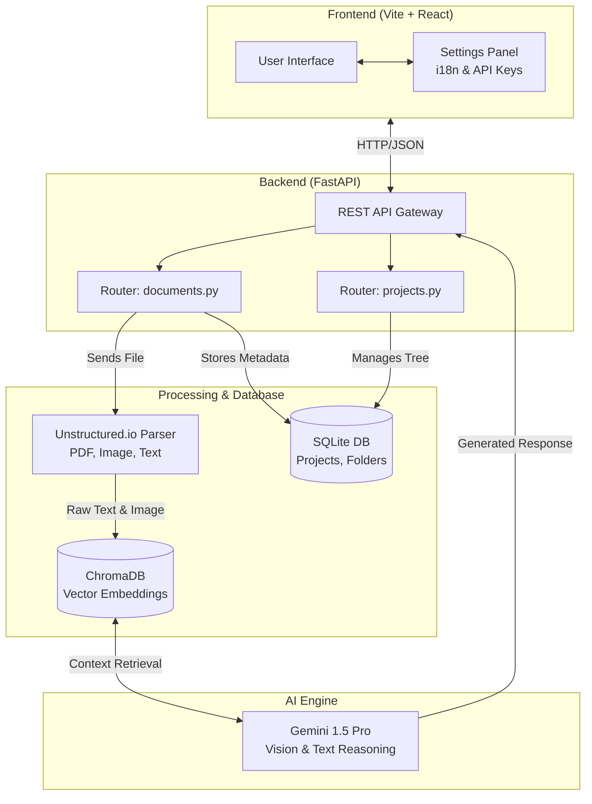

# Multimodal RAG Application

This is a generic template project for a Multimodal Retrieval-Augmented Generation (RAG) system. It demonstrates how to build a flexible chat interface supporting multiple AI providers (Gemini, OpenAI, Claude, local Ollama) and various document formats.

**Project Repository:** [https://github.com/TwinMindWeekly/06_04_2026_multimodal_rag_ai](https://github.com/TwinMindWeekly/06_04_2026_multimodal_rag_ai)

## Features

- **Multi-Provider Support:** Switch between Gemini, OpenAI, Claude, and Local Ollama easily.
- **Multimodal Document Processing:** Analyze Text, PDFs, Office Documents, and Images.
- **Multi-language UI:** Support for multiple languages (English, Vietnamese).
- **Project Structure:** Organized tree structure for file management.
- **Modern UI:** Built with React/Vite using a glassmorphism design.

## Structure

- `frontend/`: The React + Vite application.
- `docs/`: Concept documentation and tech stack choices.

## System Architecture

## Getting Started

1. Navigate to the root directory `06_04_2026_multimodal_rag_ai`.
2. Double-click on `start.bat` (or run `.\start.bat` in your terminal).
3. The script will automatically open two terminal windows, starting both the FastAPI Backend (Port 8000) and the React Frontend (Port 5173).
4. Access the web interface at [http://localhost:5173](http://localhost:5173).
